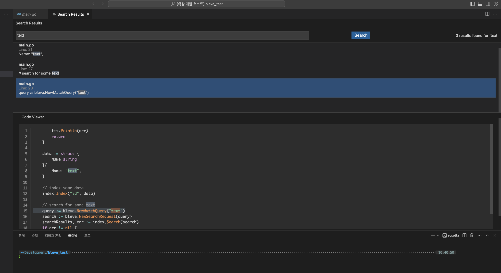

# Custom Search Extension

## 한국어 (Korean)

### 소개

Custom Search Extension은 VS Code에서 검색 결과를 모달 형태의 웹뷰로 표시하는 확장 기능입니다.

### 사용 방법

1. 명령 팔레트(`Ctrl+Shift+P` 또는 `Cmd+Shift+P` on Mac)에서 `Show Custom Search Results`를 입력하고 실행합니다.
2. 검색어를 입력하고 결과를 확인합니다.

### 사용 예시

### 라이선스

이 프로젝트는 MIT 라이선스 하에 배포됩니다. 자세한 내용은 [LICENSE](LICENSE) 파일을 참조하세요.

**즐겁게 사용하세요!**

---

## English (ENG)

### Introduction

Custom Search Extension is a VS Code extension that displays search results in a modal-like webview.

### Usage

1. Open the command palette (`Ctrl+Shift+P` or `Cmd+Shift+P` on Mac) and type `Show Custom Search Results`.
2. Enter a search term and view the results.

### Example Usage

### License

This project is licensed under the MIT License. See the [LICENSE](LICENSE) file for details.

**Enjoy!**
